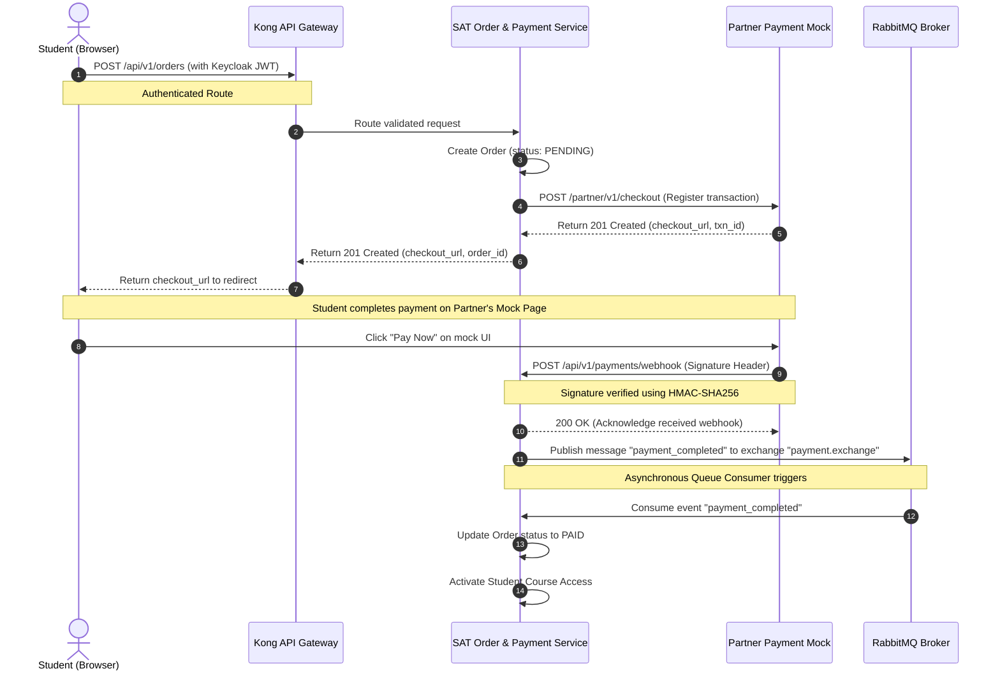

# 02. Business Workflow

This document models the primary transactional integration workflow between the Student, the SAT Learning platform, and the Payment Partner.

## Step-by-Step Flow Explanation
1. **Initiate Order**: The student requests a checkout session by sending the course selection and student ID. This request passes through Kong Gateway and requires authentication via Keycloak-issued JWT.
2. **Register Payment Gateway**: The Order & Payment Service registers the transaction with the Partner Mock Service.
3. **Redirect Client**: The client receives a `checkout_url` directing them to the mock checkout portal.
4. **Mock Processing**: The student simulates payment completion.
5. **Asynchronous Webhook**: The payment gateway calls the backend webhook asynchronously. The webhook is validated for authenticity using a shared secret signature.
6. **Queue Event**: Upon validation, the payment webhook handler publishes a message to RabbitMQ and responds with HTTP 200 immediately.
7. **Process Course Activation**: A background worker consumes the event, updates the database, and unlocks the student's learning portal.
