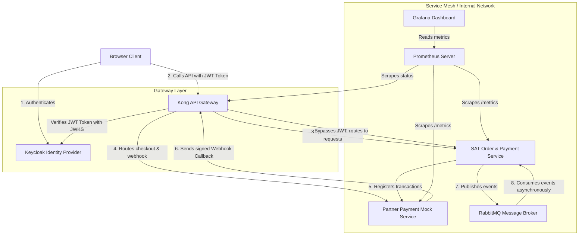

# 03. System Architecture

## Architecture Overview
The SAT Learning API integration leverages a decoupled microservices design utilizing an API Gateway for routing and authentication, and a message broker for event-driven reliability.

## Component Breakdown
1. **Kong API Gateway**:
   - Single entrypoint for all clients.
   - Handles rate limiting, logging, and JWT validation.
   - Exposes port `8000` for public traffic and `8001` for admin configurations.
2. **Keycloak Identity Provider**:
   - Manages client realms, users, roles, and client-credentials tokens.
   - Works as the OAuth2 issuer. Kong verifies client request JWTs using Keycloak public keys.
3. **SAT Order & Payment Service**:
   - Core backend service managing course order registrations and webhook collections.
   - Integrates an AMQP publisher and consumer to achieve eventual consistency.
4. **Partner Payment Mock Service**:
   - Simulates a real-world third-party bank/wallet gateway.
   - Verifies API integrations and signs webhook requests.
5. **RabbitMQ**:
   - Decouples transaction handling from order updates.
   - Standardizes the `payment.exchange` and buffers request load.
6. **Observability (Prometheus & Grafana)**:
   - Scrapes metrics endpoints of microservices and infrastructure.
   - Provides visualization dashboards of HTTP metrics and system health.
