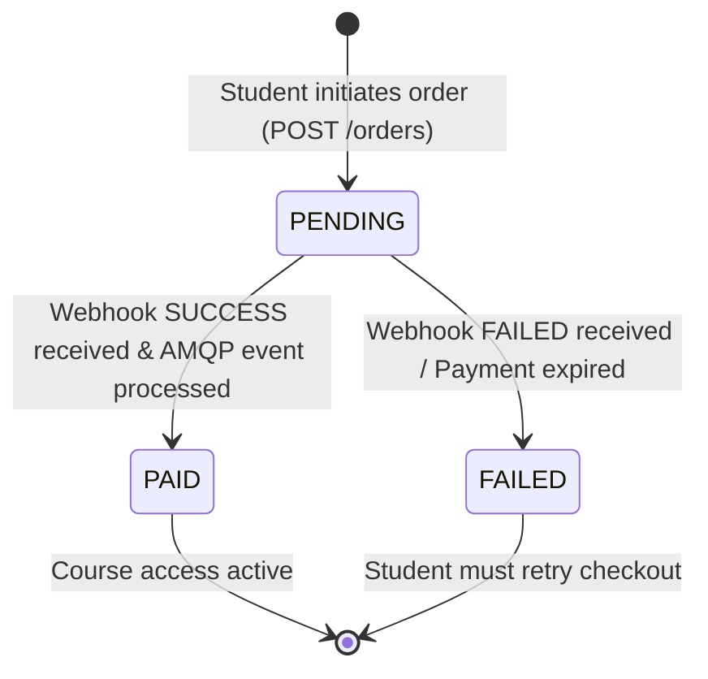

# 04. Database Design

## Schema Specifications (In-Memory Stubs)
For the purpose of this lab, services implement an in-memory repository mock representing relational tables. In production, these schemas map directly to SQL databases like PostgreSQL.

### 1. Order Table (`orders`)
Holds data regarding student registrations and payment tracking.

| Field Name | Data Type | Key / Constraint | Description |
| :--- | :--- | :--- | :--- |
| `order_id` | `VARCHAR(64)` | Primary Key | Unique order identifier, prefixed with `ORD-SAT-`. |
| `student_id` | `VARCHAR(64)` | Not Null | References the keycloak/student account ID. |
| `course_code` | `VARCHAR(64)` | Not Null | Code representing course package (e.g., `SAT-MATH-PRO`). |
| `amount` | `DECIMAL(12,2)`| Not Null | Cost of the course package. |
| `status` | `VARCHAR(20)` | Not Null | State of the order (`PENDING`, `PAID`, `FAILED`). |
| `transaction_id` | `VARCHAR(64)` | Nullable | References the partner gateway transaction code. |
| `created_at` | `TIMESTAMP` | Default Now | Order creation time. |
| `updated_at` | `TIMESTAMP` | Default Now | Last update time. |

### 2. Transaction Log Table (`transactions`)
Logs incoming payment payloads received from the webhook to prevent duplicate processing.

| Field Name | Data Type | Key / Constraint | Description |
| :--- | :--- | :--- | :--- |
| `transaction_id` | `VARCHAR(64)` | Primary Key | Unique transaction code from partner. |
| `order_id` | `VARCHAR(64)` | Foreign Key | References `orders.order_id`. |
| `amount` | `DECIMAL(12,2)`| Not Null | Amount reported as paid. |
| `status` | `VARCHAR(20)` | Not Null | Payment state (`SUCCESS`, `FAILED`). |
| `signature` | `TEXT` | Not Null | Webhook signature used for validation verification. |
| `received_at` | `TIMESTAMP` | Default Now | Timestamp when webhook was accepted. |

## State Machine Diagram
The status of an order flows according to the diagram below:

