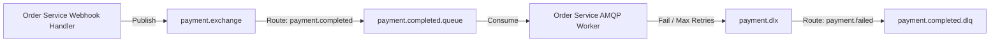

# 12. RabbitMQ Event-Driven Integration

To ensure reliable payment state synchronization under peak load, the integration uses RabbitMQ for event queuing.

## Topology Layout
- **Exchange**: `payment.exchange` (type: `topic`)
- **Main Queue**: `payment.completed.queue`
- **Routing Key**: `payment.completed`
- **Dead Letter Exchange (DLX)**: `payment.dlx` (type: `direct`)
- **Dead Letter Queue (DLQ)**: `payment.completed.dlq`
- **DLQ Routing Key**: `payment.failed`

## Failure Handling Strategy
1. **At-Least-Once Delivery**: The consumer uses manual message acknowledgements (`noAck: false`). A message is deleted from the queue only after successful DB writes.
2. **Retry Mechanism**: If updating the database fails due to a transient database lock:
   - The message is nacked.
   - We track the retry count inside the headers (`x-death`).
   - If retries exceed 3 times, the message is routed to the Dead Letter Queue (DLQ) to prevent blocking the main queue.
3. **Idempotent Consumer**: Before processing enrollment, the consumer checks if the target `order_id` already has `PAID` status. If so, it acknowledges the message and discards it.
